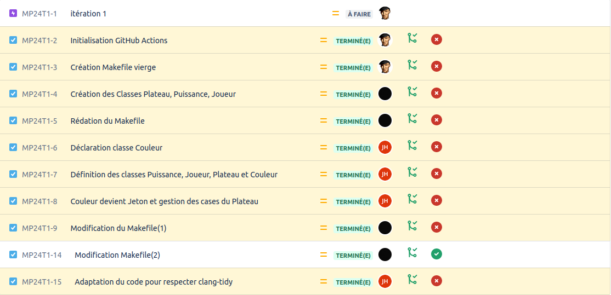
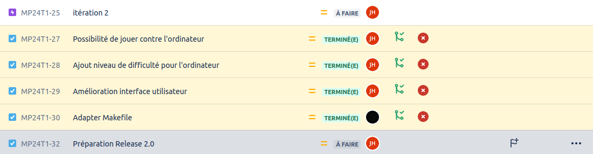
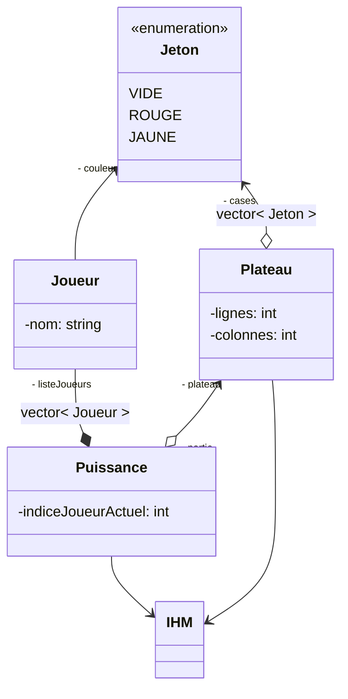
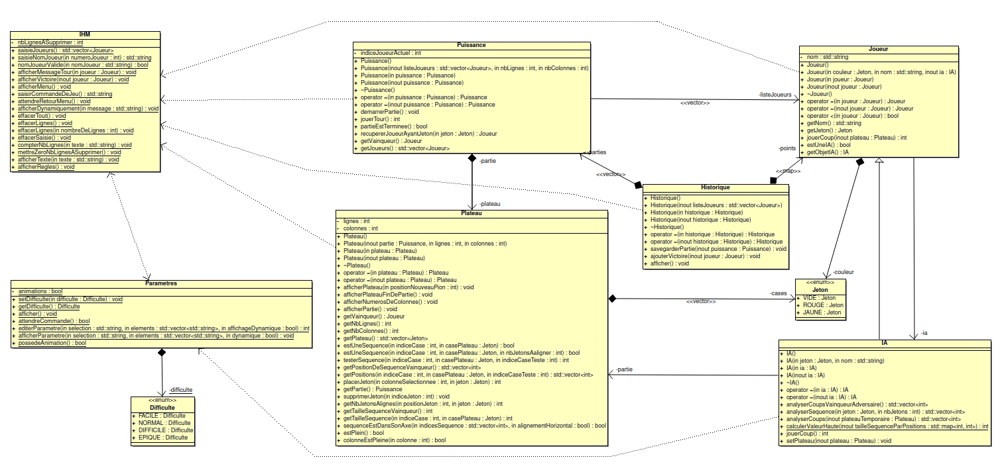

[](https://github.com/btssn-lasalle-84/MP24-T1-PUISSANCE4/actions/workflows/c-cpp.yml)[](https://github.com/btssn-lasalle-84/MP24-T1-PUISSANCE4/actions/workflows/cppformat.yml)

# Mini-Projet Puissance 4

## Informations

- Nom du logiciel : Puissance 4
- Date de début : 24 novembre 2023 à 14:58
- Numéro de version du logiciel : 2.0

## Présentation

Ce projet implémente le jeu classique "Puissance4" en POO/C++. Le jeu met en scène deux joueurs qui alternent pour placer des jetons de couleur dans une grille suspendue verticalement. L'objectif est de connecter quatre jetons de sa propre couleur consécutivement en ligne (horizontalement, verticalement ou diagonalement) avant l'adversaire.

Lien Wikipédia : [Puissance 4](https://fr.wikipedia.org/wiki/Puissance_4)

## Utilisation

```bash
$ make

$ ./puissance4.out
```

## Ce que le logiciel fait dans cette version

Permet de jouer une partie de Puissance 4 à deux joueurs.

### Version 2.0

- [x] Jouer une ou plusieurs parties
- [x] Historique de parties jouées
- [x] Paramétrage de la partie
- [x] Jouer contre l'odinateur (IA)
- [x] Nouveau modes de jeux:
  - Joueur vs Joueur
  - Joueur vs IA
  - IA vs IA
- [x] Choix de la difficulté de l'IA
  - **FACILE**: Elle contrera les coups adverse une fois sur trois
  - **NORMALE** (par défaut): Elle contrera les coups adverse trois fois sur cinq
  - **DIFFILE**: Elle contrera les coups adverse cinq fois sur six
  - **EPIQUE** (pour le fun): Elle contrera tous les coups adverse et privilègera sa contre-attaque à sa victoire

### Version 1.1

- [x] Affichage de Nom et version du jeu
- [x] Affichage d'un menu
- [x] Correction de bug

### Version 1.0

- [x] saisir le nom du joueur
- [x] jouer une partie
- [x] afficher le déroulement d’une partie


## TODO

### Version 3.0

- [ ] Configuration de la grille et du nombre de pions à aligner
- [ ] Affichage des statistiques du joueur
- [ ] Sauvegarde des statistiques du joueur dans un fichier
- [ ] Chronométrage de la partie

## Défauts constatés non corrigés


## Itérations 1



## Itérations 2



## Diagramme du domaine




## Diagramme de classes



## Équipe de développement

- [Jules HILLION](mailto:redisbackhere@gmail.com)
- [Thomas HNIZDO](mailto:thomas.hnizdo@gmail.com)

---
&copy; 2023 LaSalle Avignon
