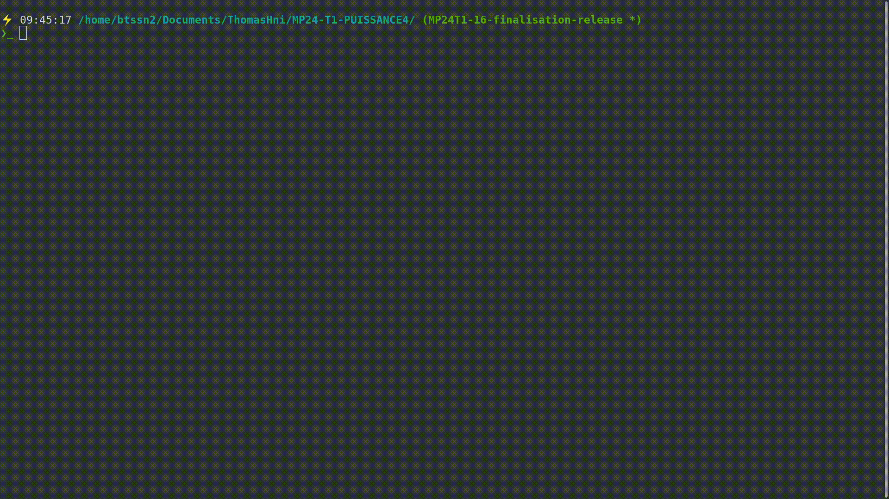
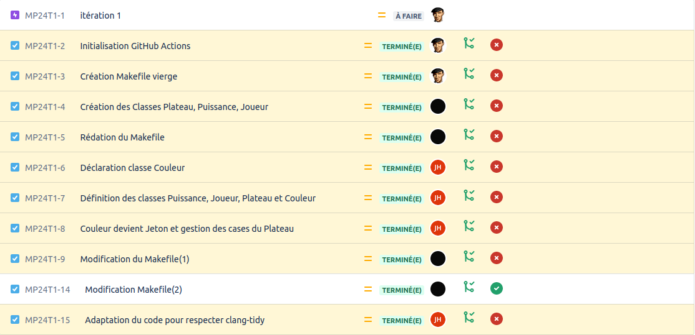
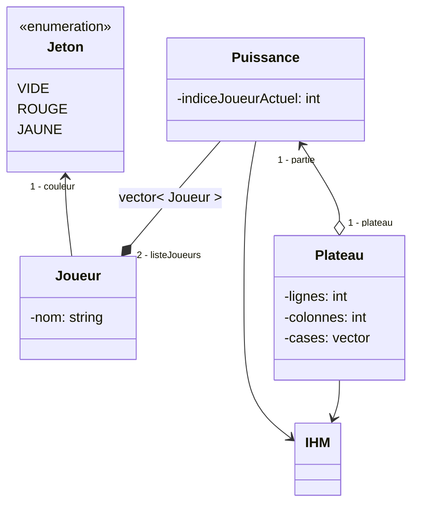

[](https://github.com/btssn-lasalle-84/MP24-T1-PUISSANCE4/actions/workflows/c-cpp.yml)[](https://github.com/btssn-lasalle-84/MP24-T1-PUISSANCE4/actions/workflows/cppformat.yml)

# Mini-Projet Puissance 4

## Informations

- Nom du logiciel : Puissance 4
- Date de début : 24 novembre 2023 à 14:58
- Numéro de version du logiciel : 1.0

## Présentation + Objectifs

Ce projet implémente le jeu classique "Puissance4" en C++. Le jeu met en scène deux joueurs qui alternent pour placer des jetons de couleur dans une grille suspendue verticalement. L'objectif est de connecter quatre jetons de sa propre couleur consécutivement en ligne (horizontalement, verticalement ou diagonalement) avant l'adversaire.

## Utilisation

Exemple :

```bash
$ make

$ ./puissance4.out
```

## Ce que le logiciel fait dans cette version

Permet de jouer une partie de Puissance 4 à deux.

### Version 1.0 :

- [x] saisir le nom du joueur
- [x] jouer une partie
- [x] afficher le déroulement d’une partie



## TODO

### Version 2.0

- [ ] Choix du niveau de difficulté.
- [ ] Possibilité de jouer une ou plusieurs parties.
- [ ] Affichage de l'historique des parties jouées.

### Version 3.0

- [ ] Configuration de la grille et du nombre de pions à aligner.
- [ ] Affichage des statistiques du joueur.
- [ ] Sauvegarde des statistiques du joueur dans un fichier.
- [ ] Chronométrage de la partie.

## Défauts constatés non corrigés

## Itérations



## Diagramme de classes (attributs uniquement)




## Diagramme de classes

> Fourni par l'enseignant

## Équipe de développement

- [Jules HILLION](mailto:redisbackhere@gmail.com)
- [Thomas HNIZDO](mailto:thomas.hnizdo@gmail.com)

---
&copy; 2023 LaSalle Avignon