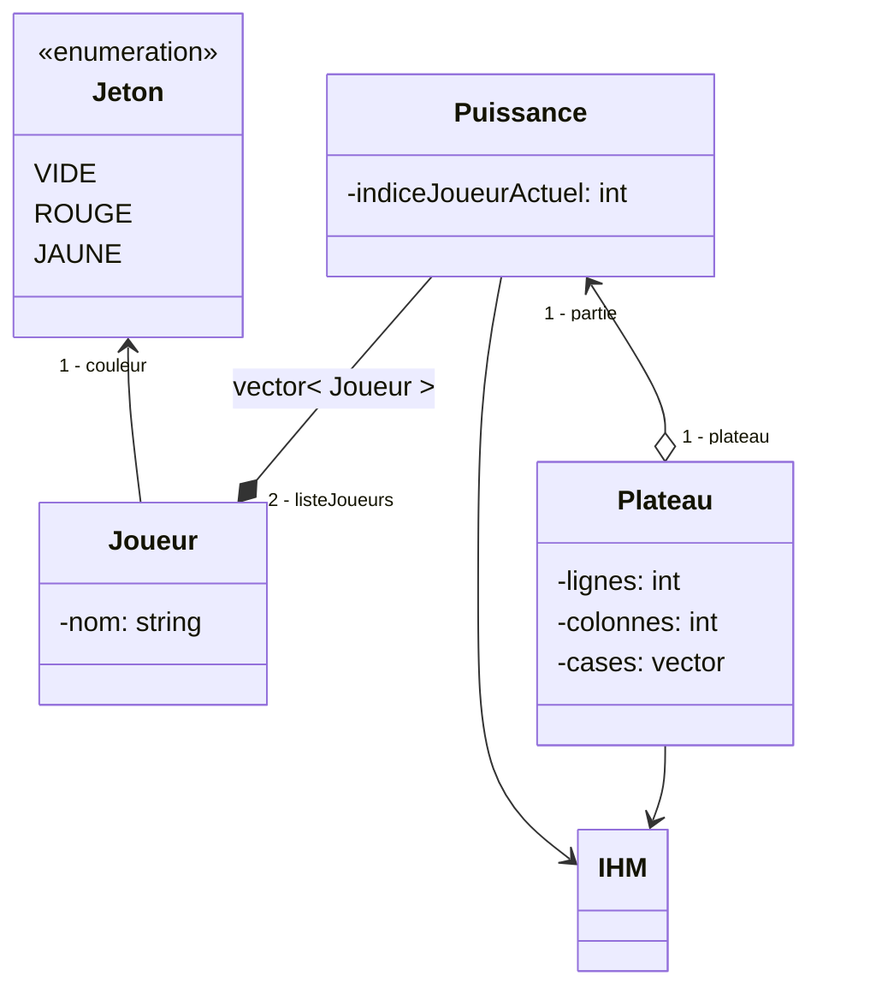
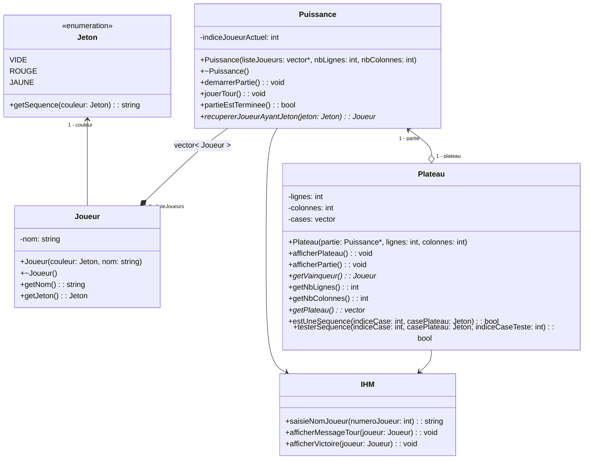

[](https://github.com/btssn-lasalle-84/MP24-T1-PUISSANCE4/actions/workflows/c-cpp.yml)[](https://github.com/btssn-lasalle-84/MP24-T1-PUISSANCE4/actions/workflows/cppformat.yml)

# Mini-Projet Puissance4
## Présentation

Ce projet implémente le jeu classique "Puissance4" en C++. Le jeu met en scène deux joueurs qui alternent pour placer des jetons de couleur dans une grille suspendue verticalement. L'objectif est de connecter quatre jetons de sa propre couleur consécutivement en ligne (horizontalement, verticalement ou diagonalement) avant l'adversaire.

## Auteurs
- HNIZDO Thomas
- HILLION Jules

---

## Classes

### Puissance
La classe principale qui coordonne le déroulement du jeu, gère les tours des joueurs et détermine la fin de la partie.

### Joueur
Représente un joueur avec une couleur attribuée et un nom.

### Plateau
Gère la structure de la grille de jeu, affiche l'état actuel du plateau et détermine le vainqueur.

### IHM
Gère les interactions avec l'utilisateur, y compris la saisie des noms des joueurs et l'affichage des messages.

### Jeton
Une énumération qui définit les couleurs possibles des jetons de jeu.

---

## Utilisation

```cpp
int main()
{
    Joueur         joueur1(Couleur(ROUGE), IHM::saisieNomJoueur(1));
    Joueur         joueur2(Couleur(JAUNE), IHM::saisieNomJoueur(2));
    std::vector<Joueur> listeJoueurs = { joueur1, joueur2 };
    Puissance      puissance(&listeJoueurs, 6, 7);
    puissance.demarrerPartie();
    return 0;
}
```

### Diagramme de classes (attributs uniquement)


### Diagramme de classes (attributs et méthodes)
