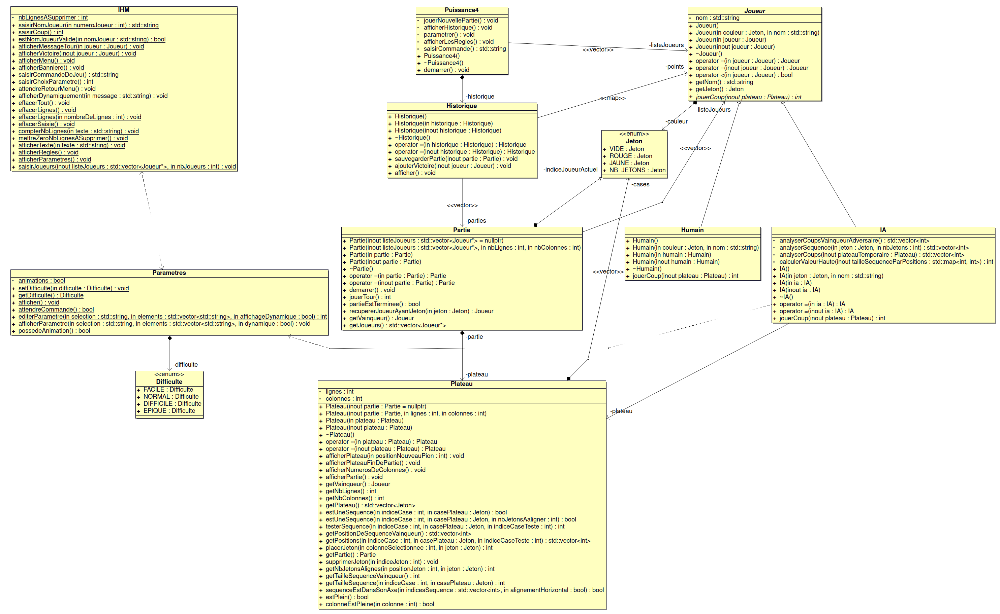
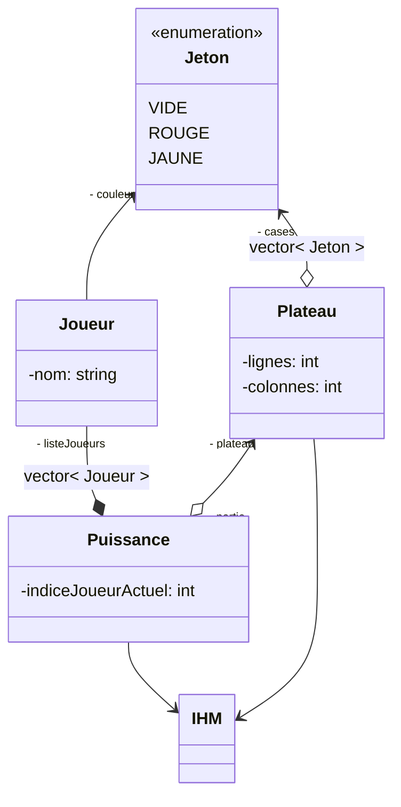

[](https://github.com/btssn-lasalle-84/MP24-T1-PUISSANCE4/actions/workflows/c-cpp.yml)[](https://github.com/btssn-lasalle-84/MP24-T1-PUISSANCE4/actions/workflows/cppformat.yml)

# Mini-Projet Puissance 4

- [Mini-Projet Puissance 4](#mini-projet-puissance-4)
  - [Informations](#informations)
  - [Présentation](#présentation)
  - [Utilisation](#utilisation)
  - [Changelog](#changelog)
    - [Version 2.2](#version-22)
    - [Version 2.1](#version-21)
    - [Version 2.0](#version-20)
    - [Version 1.1](#version-11)
    - [Version 1.0](#version-10)
  - [TODO](#todo)
    - [Version 3.0](#version-30)
  - [Défauts constatés non corrigés](#défauts-constatés-non-corrigés)
  - [Itérations](#itérations)
    - [Itération 1](#itération-1)
    - [Itération 2](#itération-2)
  - [Diagramme de classes](#diagramme-de-classes)
  - [Diagramme du domaine](#diagramme-du-domaine)

---

## Informations

- Nom du logiciel : Puissance 4
- Date de début : 24 novembre 2023
- Numéro de version du logiciel : 2.2

Équipe de développement

- [Jules HILLION](mailto:redisbackhere@gmail.com)
- [Thomas HNIZDO](mailto:thomas.hnizdo@gmail.com)

## Présentation

Ce projet implémente le jeu classique "Puissance4" en POO/C++. Le jeu met en scène deux joueurs qui alternent pour placer des jetons de couleur dans une grille suspendue verticalement. L'objectif est de connecter quatre jetons de sa propre couleur consécutivement en ligne (horizontalement, verticalement ou diagonalement) avant l'adversaire.

Lien Wikipédia : [Puissance 4](https://fr.wikipedia.org/wiki/Puissance_4)

## Utilisation

```bash
$ make

$ ./puissance4.out
```


## Changelog

Le logiciel permet de jouer une partie de Puissance 4 à deux joueurs.

### Version 2.2

- [x] Correction version 2.1
- [x] Simplification interaction Homme-Machine
- [x] Affichage du menu et version

### Version 2.1

- [x] Correction version 2.0
- [x] Correction affichage interface

### Version 2.0

- [x] Jouer une ou plusieurs parties
- [x] Historique de parties jouées
- [x] Paramétrage de la partie
- [x] Jouer contre l'odinateur (IA)
- [x] Nouveaux modes de jeux :
  - Joueur vs Joueur
  - Joueur vs IA
  - IA vs IA
- [x] Choix de la difficulté de l'IA :
  - **FACILE** : Elle contrera les coups adverses une fois sur trois
  - **NORMALE** (par défaut) : Elle contrera les coups adverses trois fois sur cinq
  - **DIFFILE** : Elle contrera les coups adverses cinq fois sur six
  - **EPIQUE** : Elle contrera tous les coups adverses et privilègera sa contre-attaque à sa victoire

### Version 1.1

- [x] Affichage de Nom et version du jeu
- [x] Affichage d'un menu
- [x] Correction de bug

### Version 1.0

- [x] Saisie du nom du joueur
- [x] Jouer une partie
- [x] Affichage du déroulement d’une partie

## TODO

### Version 3.0

- [ ] Configuration de la grille et du nombre de pions à aligner
- [ ] Affichage des statistiques du joueur
- [ ] Sauvegarde des statistiques du joueur dans un fichier
- [ ] Chronométrage de la partie

## Défauts constatés non corrigés

## Itérations

### Itération 1


### Itération 2


## Diagramme de classes



## Diagramme du domaine



---
&copy; 2023-2024 LaSalle Avignon
